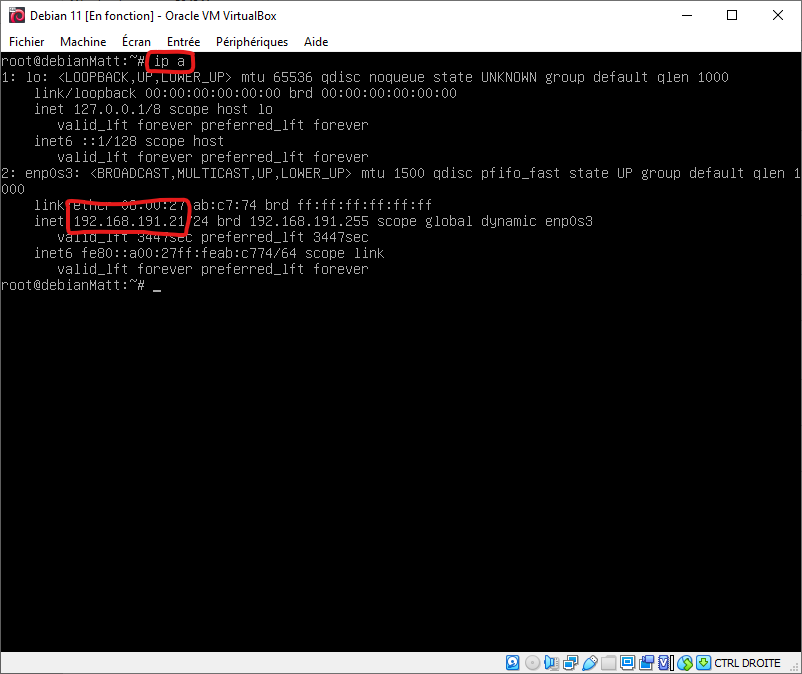

# SSH

- ## Installation et création d'une clé SSH

Pour installer SSH il faut utiliser cette commande :  
`apt-get install SSH`

Ici je vais me connecter à ma vm Debian à partir mon pc Windows

- Tout d'abord Je récupère l'ip de ma Debian avec la commande `ip a`

- Ensuite sur Windows je rentre le commande ``ssh [UtilisateurDebian]@ipv4`` ici matteo@192.168.191.21

:warning: *pour toute la durée de la manipulation avec le ssh j'utilise le partage de connexion de mon téléphone car les réseaux privées peuvent bloquer le `port 22`, port utiliser par le protocole ssh* :warning:

Je suis à présent connecter à ma vm Debian depuis Windows.
